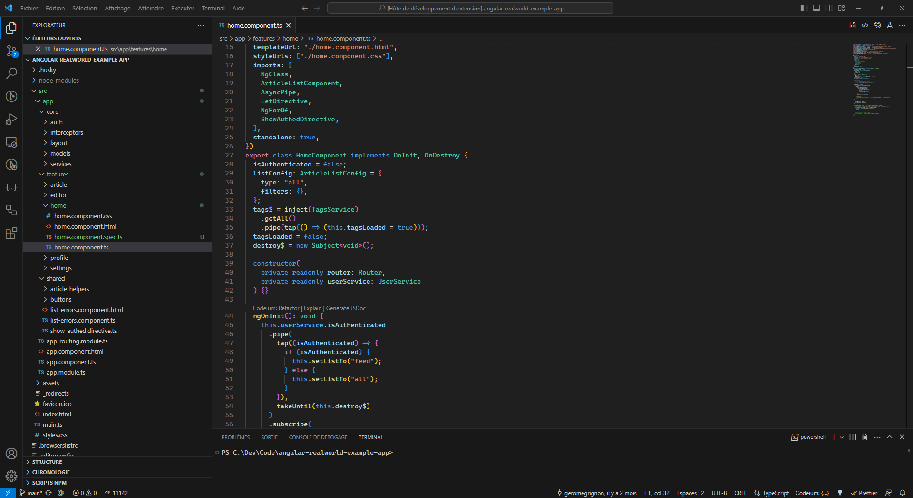

Quick navigate on angular file with button on top bar or shortcut.

## Features

- Navigate with topbar button (Can be disabled on settings)
- Press `Ctrl+Win+F5` to go on typescript component file (\*.ts)
- Press `Ctrl+Win+F6` to go on html component file (\*.html)
- Press `Ctrl+Win+F7` to go on style component file (\*.css|less|scss)
- Press `Ctrl+Win+F8` to go on test component file (spec.ts)

Work with component, directive, pipe and service.

## Requirements

VSCode >= 1.79

## Extension Settings

- Disable topbar button with `Nagular > Show icon to navigate in action bar` setting
- Custom every shortcut

## Release Notes

### 1.0.0

Initial release
